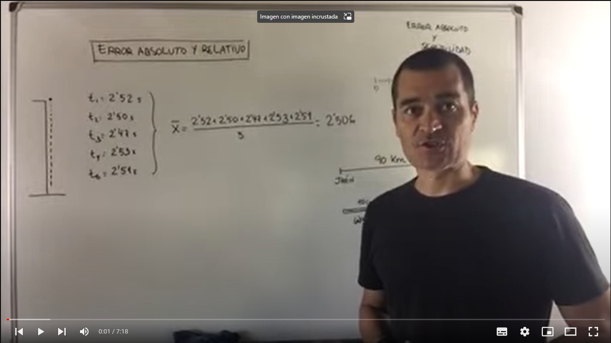

<h1 style="color: #a2e52a">Error Absoluto y Relativo</h1>

[Click aqui para usar la Calculadora](https://andresflorez0799.github.io/calculadora/src/index.html)

<a href="https://github.com/andresflorez0799/calculadora" target="_blank">Click para ver el repo en Github</a>

  
  <caption>Tomado de: 
  <a href="https://www.youtube.com/watch?v=bhlCrzn_rGU&list=RDLVbhlCrzn_rGU&index=1" target="_blank">Youtube</a>
  </caption>

  <caption>Tomado de: 
  <a href="https://solucionesproblemas.com/error-absoluto-y-error-relativo/" target="_blank">https://solucionesproblemas.com</a>
  </caption>

